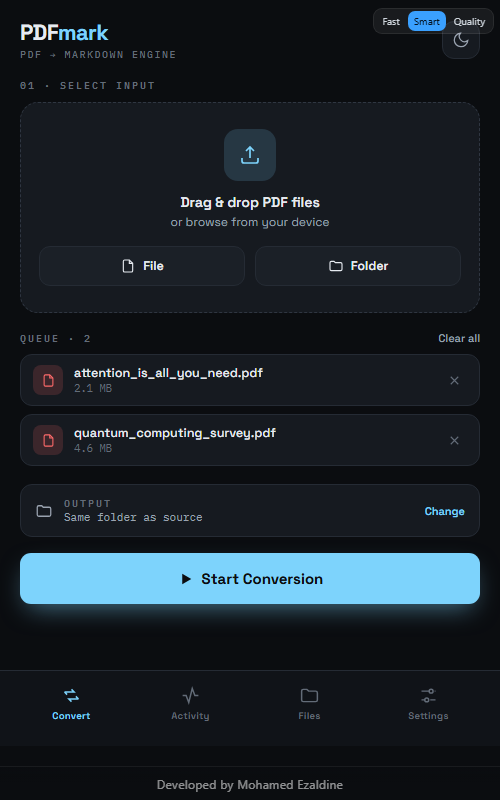
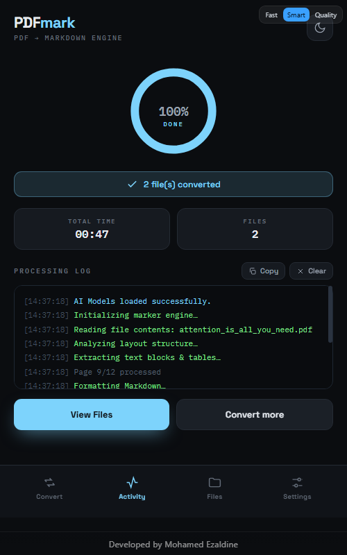

# PDFmark 📄➡️💻

A free Windows desktop app for researchers and academics that converts scientific papers (PDF) into clean, high-fidelity Markdown — preserving math (LaTeX), complex tables, and column layout.

---

## 📥 Download

Grab the latest installer from **[Releases](../../releases/latest)** and run `PDFmark_Setup.exe`. The installer downloads the AI models needed for the Quality/Smart engines during setup itself (a one-time step that needs internet), so the app is ready to use immediately afterward — no extra wait on first conversion.

**Requirements:** Windows 10/11 (64-bit). [WebView2 Runtime](https://developer.microsoft.com/microsoft-edge/webview2/) is preinstalled on most modern Windows machines.

---

## 🖼️ Screenshots

  
  &nbsp;&nbsp;
  

---

## ✨ Features

* **Three conversion engines**, switchable right from the UI:
  * ⚡ **Fast** — no AI, converts in seconds. Best for plain text papers/reports.
  * 🧠 **Smart** — hybrid: every page converts fast, but pages that look like they hold a table, heavy math, or a scan get reprocessed with the Quality engine. Nearly Quality's accuracy at a fraction of the time.
  * 🎯 **Quality** — full AI layout analysis + OCR. Most accurate for scanned or complex documents, but slower.
* Real, working Cancel mid-conversion.
* Settings (preferred engine, output folder) persist between launches.
* Detailed processing log plus an on-disk log file for troubleshooting.

---

---

**Developed by:** Mohamed Ezaldine
